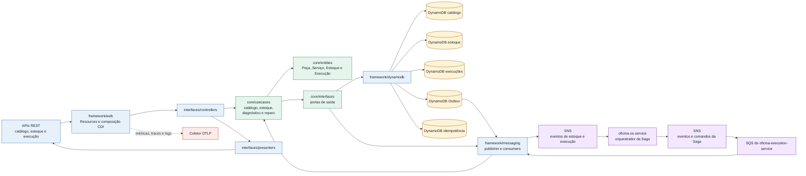
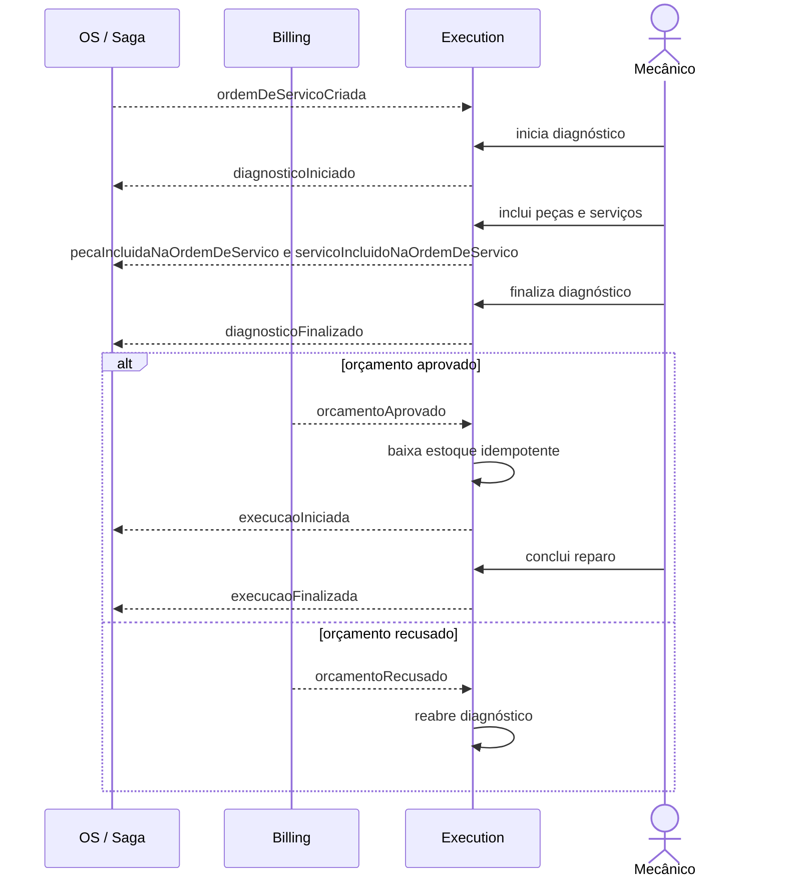

# oficina-execution-service

Microsserviço responsável por catálogo técnico, peças, serviços, estoque, diagnóstico, execução e reparo da plataforma de oficina.

Este repositório segue a governança definida em [../oficina-platform](../oficina-platform/). Para tarefas automatizadas, leia também [AGENTS.md](AGENTS.md) e [TODO.md](TODO.md).

## Responsabilidades

- manter catálogo técnico de peças e serviços;
- controlar saldo e movimentos de estoque;
- registrar diagnóstico, execução e reparo;
- manter histórico operacional;
- produzir e consumir eventos operacionais e de estoque usados pela Saga.

O serviço não é dono de Cliente, Veículo, estado global da Ordem de Serviço, orçamento ou pagamento.

## Saga orquestrada

A plataforma usa **Saga orquestrada** pelo `oficina-os-service`, conforme a [ADR-009 - Estratégia de Saga Pattern](../oficina-platform/adr/ADR-009%20-%20Estratégia%20de%20Saga%20Pattern.md), os [Fluxos da Saga da Ordem de Serviço](../oficina-platform/docs/architecture/saga-flows.md) e o [Contrato de Saga do oficina-os-service](../oficina-platform/contracts/saga/oficina-os-saga-v1.md).

O `oficina-os-service` foi escolhido como orquestrador porque é a autoridade sobre o estado global da Ordem de Serviço e concentra a sequência distribuída do processo. Essa escolha mantém o fluxo explícito, melhora a rastreabilidade e evita que compensações fiquem dispersas entre os serviços participantes.

O `oficina-execution-service` participa da Saga como autoridade operacional. Ele gerencia diagnóstico, execução, reparo, estoque e eventos técnicos consumidos pelo orquestrador. O serviço não decide sozinho o estado global da OS; ele preserva seu domínio em DynamoDB enquanto responde a comandos idempotentes e eventos definidos nos contratos da plataforma.

## Stack

- Java 25
- Quarkus 3.37.0
- Amazon DynamoDB
- JWT, OpenAPI, Health, métricas Prometheus, logs JSON e OpenTelemetry

## Arquitetura



O serviço possui ownership de catálogo técnico, estoque e execução. A integração com a Saga é assíncrona e idempotente; o estado global da Ordem de Serviço permanece sob responsabilidade do `oficina-os-service`.

## Fluxo técnico



O Execution consome os eventos de criação da OS e decisão do orçamento necessários à projeção técnica. Produz eventos de diagnóstico, itens, estoque e execução pela Outbox DynamoDB. O roteamento completo está na [tabela canônica de mensageria](../oficina-platform/contracts/Contrato%20de%20T%C3%B3picos%20de%20Mensageria.md#tabela-can%C3%B4nica-de-roteamento), e a colaboração completa está na [visão transversal da plataforma](../oficina-platform/README.md#fluxos-operacionais).

## Persistência

A persistência runtime usa `DynamoDbClient` síncrono com as tabelas definidas no [Padrão DynamoDB do oficina-execution-service](../oficina-platform/docs/infrastructure/dynamodb-execution-service.md). O store grava e lê catálogo, estoque, execuções, Outbox e idempotência no DynamoDB, mantendo os itens canônicos `PK`, `SK`, `entityType` e os atributos necessários aos GSIs documentados.

Os testes do serviço sobem DynamoDB Local via Testcontainers, criam as cinco tabelas canônicas com os GSIs esperados e exercitam as APIs HTTP, o consumo de eventos e os mapeamentos técnicos sem depender de estruturas em memória como persistência principal.

O serviço não possui fallback de persistência para memória. Os profiles `dev` e `test` podem usar deliberadamente DynamoDB Local e LocalStack; os runtimes protegidos usam somente dependências AWS reais.

## Proteção de runtime

O runtime é protegido quando qualquer profile Quarkus ativo é `prod` ou `lab`, ou quando `DEPLOYMENT_ENVIRONMENT=lab`. Nesses casos, a inicialização falha antes de aceitar tráfego se ocorrer qualquer uma destas condições:

- região AWS, prefixo das tabelas DynamoDB, issuer, audience ou localização do JWKS ausentes ou com placeholder;
- mensageria, publisher, consumer ou worker desabilitados;
- endpoint alternativo de DynamoDB, SNS ou SQS configurado;
- credenciais AWS estáticas parciais;
- tabela DynamoDB ausente ou fora do estado `ACTIVE`;
- identidade IAM inválida, tópico SNS produzido ausente ou fila SQS consumida ausente/inacessível.

A validação de infraestrutura é não destrutiva e usa STS, `DescribeTable`, `GetTopicAttributes` e `GetQueueUrl`. A cadeia padrão de credenciais AWS, incluindo IAM Role/IRSA, permanece preferencial e não exige secrets de access key. Quando credenciais estáticas forem necessárias, informe `AWS_ACCESS_KEY_ID` e `AWS_SECRET_ACCESS_KEY`; acrescente `AWS_SESSION_TOKEN` para credenciais temporárias.

## Mensageria SNS/SQS

O serviço publica eventos de diagnóstico, execução e estoque exclusivamente pela Outbox DynamoDB. Quando `OFICINA_MESSAGING_ENABLED=true`, o worker assíncrono publica pendentes no SNS canônico, aplica retry/backoff, marca `PUBLISHED` após sucesso e marca `FAILED` ao esgotar tentativas. O consumo usa filas SQS por tópico/consumidor e só remove a mensagem depois que a idempotência e o processamento local são persistidos no DynamoDB.

Ao consumir `orcamentoAprovado`, o serviço inicia o reparo apenas se o diagnóstico estiver concluído e registra `execucaoIniciada` na Outbox na mesma transação da mudança operacional. A idempotência do evento impede uma segunda publicação; aprovações entregues antes de existir o contexto local podem criá-lo, mas não antecipam diagnóstico nem reparo.

Configuração principal:

- `OFICINA_MESSAGING_ENABLED`
- `OFICINA_MESSAGING_ENDPOINT_OVERRIDE`, somente para LocalStack em `dev` ou `test`
- `OFICINA_MESSAGING_PUBLISHER_BATCH_SIZE`
- `OFICINA_MESSAGING_PUBLISHER_MAX_ATTEMPTS`
- `OFICINA_MESSAGING_CONSUMER_MAX_MESSAGES`
- `OFICINA_MESSAGING_CONSUMER_WAIT_TIME_SECONDS`

Os nomes físicos de tópicos e filas seguem o padrão do `oficina-infra`: pontos do tópico canônico são trocados por hífen, e filas consumidoras usam `<topico>.<servico-consumidor>`. A validação local de publicação e consumo SNS/SQS fica em [SnsSqsMessagingIntegrationTest](src/test/java/br/com/oficina/execution/framework/messaging/SnsSqsMessagingIntegrationTest.java), com LocalStack e DynamoDB Local via Testcontainers.

## Setup local

Pré-requisitos:

- Java 25;
- Docker, para build de imagem e dependências locais;
- acesso ao repositório `../oficina-platform`, usado pelos testes de contrato;
- acesso opcional ao repositório `../oficina-infra`, usado para subir dependências compartilhadas da suíte.

Ferramentas locais recomendadas para validação de CI/CD, Dockerfile e scripts estão em [Ferramentas de validação local](../oficina-platform/docs/delivery/validation-tooling.md).

Dependências locais compartilhadas podem ser iniciadas pelo `oficina-infra`:

```bash
cd ../oficina-infra
docker compose -f compose.local.yml up -d postgres dynamodb localstack
scripts/local/bootstrap-local.sh
```

Volte para este repositório antes de executar o serviço:

```bash
cd ../oficina-execution-service
```

## Execução local

```bash
./mvnw quarkus:dev -Pdynamodb
./mvnw test -Pdynamodb
./mvnw -B verify -Pdynamodb -DskipITs=false -DfailIfNoTests=false
./mvnw -B package -Pdynamodb
```

O `quarkus:dev` ativa o profile `dev`, no qual endpoints locais são permitidos de forma explícita. O comando `verify` executa testes unitários, integração, contrato e verificação de cobertura JaCoCo.

## Cobertura

O JaCoCo é executado no `verify`, gera relatório em `target/jacoco-report/` e falha o build quando a cobertura de instruções do bundle fica abaixo do gate local de 90%, superior ao mínimo normativo de 80%. O [Template GitHub Actions para Microsserviços](../oficina-platform/templates/github-actions/README.md) publica esse diretório como artifact `jacoco-report-oficina-execution-service` e envia `target/jacoco-report/jacoco.xml` ao SonarCloud.

Evidência local de cobertura em 2026-07-12:

```text
./mvnw -B clean verify -Pdynamodb -DskipITs=false -DfailIfNoTests=false
instruction=93.04% branch=80.43% line=93.44% complexity=83.96%
Tests run: 99, Failures: 0, Errors: 0, Skipped: 0
BUILD SUCCESS
```

## CI/CD

Os workflows ficam em [.github/workflows/service-ci.yml](.github/workflows/service-ci.yml) e [.github/workflows/open-pr-to-main.yml](.github/workflows/open-pr-to-main.yml), derivados do [Template GitHub Actions para Microsserviços](../oficina-platform/templates/github-actions/README.md).

Pull requests e pushes na `main` executam o check `service-ci-validate` com `./mvnw -B verify -Pdynamodb -DskipITs=false -DfailIfNoTests=false`, validam o gate local de 90% de cobertura de instruções, publicam o artifact `jacoco-report-oficina-execution-service` e executam SonarCloud com o relatório `target/jacoco-report/jacoco.xml`. O secret `SONAR_TOKEN` deve existir no repositório ou na organização GitHub, e a Automatic Analysis do SonarCloud deve ficar desabilitada para evitar análise duplicada sem cobertura.

A publicação de imagem e o deploy Kubernetes são automáticos por padrão em `main` e podem ser desligados explicitamente:

- `ENABLE_IMAGE_PUBLISH=false` desabilita consulta ao ECR, build/push da imagem Docker e release com metadados da imagem;
- `ENABLE_K8S_DEPLOY=false` desabilita materialização ou atualização do Deployment no EKS e validação do rollout;
- com as variáveis ausentes, o workflow publica imagem/release quando necessário e aplica o Deployment no EKS;
- em `workflow_dispatch`, os inputs `publish_image` e `deploy` permitem forçar esses estágios mesmo quando as variáveis foram desabilitadas.

O workflow não usa GitHub Environment para evitar aprovação manual nos jobs. As variáveis e secrets de AWS/ECR/EKS devem estar em nível de repositório ou organização, e o controle manual do fluxo acontece no merge do PR aberto automaticamente a partir da branch `develop`.

Quando `ENABLE_K8S_DEPLOY` não é `false`, o workflow valida e aplica a base canônica em `k8s/base/`, usando o `oficina-infra` para compor os valores e secrets do ambiente `lab`, aguarda o rollout no EKS e confere a imagem final. Após recriar a infraestrutura base do lab, não é necessário executar um segundo `Deploy Lab` apenas para materializar este serviço.

## Validação de contratos

O teste [PlatformContractsTest](src/test/java/br/com/oficina/execution/contracts/PlatformContractsTest.java) valida o serviço contra os contratos canônicos em `../oficina-platform/contracts`: OpenAPI, schemas JSON de eventos, [Contrato de Erros REST](../oficina-platform/contracts/error-model.md), [Contrato de Idempotência](../oficina-platform/contracts/idempotency.md) e [Contrato de Saga do oficina-os-service](../oficina-platform/contracts/saga/oficina-os-saga-v1.md).

## Docker

```bash
docker build --build-arg MAVEN_PROFILE=dynamodb -t oficina-execution-service:local .
docker run --rm -p 8080:8080 --env-file .env.runtime oficina-execution-service:local
```

A imagem empacotada inicia no profile `prod`; o arquivo local não versionado `.env.runtime` deve fornecer as configurações obrigatórias e apontar para recursos AWS acessíveis. Para desenvolvimento com emuladores, use `quarkus:dev`.

## Kubernetes

A estratégia de entrega dos manifests está definida em [Estratégia de entrega dos manifestos Kubernetes](../oficina-platform/docs/infrastructure/kubernetes-manifest-strategy.md).

Este repositório é a fonte canônica do Dockerfile e da base Kubernetes executável em [`k8s/base/`](k8s/base/). O `oficina-infra` mantém a composição, os secrets e os componentes compartilhados do ambiente `lab`; o template normativo permanece em [Template Kubernetes do oficina-execution-service](../oficina-platform/templates/kubernetes/base/oficina-execution-service/).

O deploy automatizado com `ENABLE_K8S_DEPLOY` diferente de `false` materializa o Deployment quando ele ainda não existe, atualiza a imagem quando ele já existe e valida o rollout no EKS usando o script canônico `scripts/manual/apply-microservices.sh` do `oficina-infra`.

## Endpoint técnico

- `GET /api/v1/status`: expõe identidade do serviço, ambiente e status técnico básico.
- `GET /api/v1/dashboard/execucao`: agrega carga por estado e a fila canônica para `administrativo` e `mecanico`; alertas de estoque permanecem vazios enquanto não houver política canônica de reposição.

Health checks do Quarkus ficam em `/q/health`, `/q/health/live` e `/q/health/ready`.

## Swagger/OpenAPI

O contrato canônico do serviço é a [OpenAPI do oficina-execution-service](../oficina-platform/contracts/openapi/oficina-execution-service.yaml), mantida no repositório de plataforma.

Com o serviço em execução local na porta `8080`, a documentação gerada pelo Quarkus fica disponível em:

- Swagger UI: `http://localhost:8080/q/swagger-ui/`;
- OpenAPI YAML: `http://localhost:8080/q/openapi`;
- OpenAPI JSON: `http://localhost:8080/q/openapi?format=json`.

O teste [PlatformContractsTest](src/test/java/br/com/oficina/execution/contracts/PlatformContractsTest.java) valida que a OpenAPI gerada em runtime mantém os caminhos e métodos definidos no contrato canônico.

## Contratos

- [Contrato de APIs REST](../oficina-platform/contracts/Contrato%20de%20APIs%20REST.md)
- [OpenAPI do oficina-execution-service](../oficina-platform/contracts/openapi/oficina-execution-service.yaml)
- [Contrato de Eventos de Domínio](../oficina-platform/contracts/Contrato%20de%20Eventos%20de%20Domínio.md)
- [Contrato de Tópicos de Mensageria](../oficina-platform/contracts/Contrato%20de%20Tópicos%20de%20Mensageria.md)
- [Contrato de Erros REST](../oficina-platform/contracts/error-model.md)
- [Contrato de Idempotência](../oficina-platform/contracts/idempotency.md)
- [Padrão DynamoDB do oficina-execution-service](../oficina-platform/docs/infrastructure/dynamodb-execution-service.md)

## Variáveis principais

- `AWS_REGION`
- `AWS_ACCOUNT_ID` (opcional; quando ausente, o serviço resolve a conta via STS)
- `AWS_ACCESS_KEY_ID` e `AWS_SECRET_ACCESS_KEY` (opcionais com IAM Role/IRSA)
- `AWS_SESSION_TOKEN` (opcional para credenciais temporárias)
- `OFICINA_DYNAMODB_TABLE_PREFIX`
- `DYNAMODB_ENDPOINT_OVERRIDE` (somente `dev` ou `test`)
- `OFICINA_MESSAGING_ENABLED`
- `OFICINA_MESSAGING_ENDPOINT_OVERRIDE` (somente `dev` ou `test`)
- `OFICINA_AUTH_ISSUER`
- `OFICINA_AUTH_AUDIENCE`
- `MP_JWT_VERIFY_PUBLICKEY_LOCATION`
- `OTEL_EXPORTER_OTLP_ENDPOINT`
- `DEPLOYMENT_ENVIRONMENT`

Em ambiente local, valores de desenvolvimento ficam em `src/main/resources/application.properties`. Em Kubernetes, variáveis de DynamoDB, mensageria e observabilidade vêm do ConfigMap canônico em [`k8s/base/configmap.yaml`](k8s/base/configmap.yaml); permissões AWS devem ser resolvidas pela infraestrutura do ambiente.

## Estrutura

```text
src/main/java/br/com/oficina/execution/
  core/
  interfaces/
  framework/
```

## Próximo Trabalho

O [TODO.md](TODO.md) é o checklist histórico das entregas concluídas. Novos incrementos são controlados no [ROADMAP da plataforma](../oficina-platform/ROADMAP.md).
